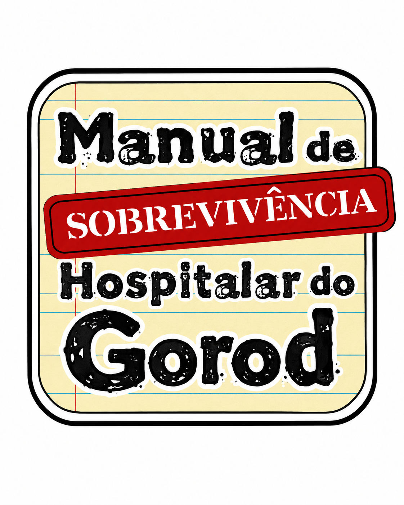

<p align="center">
  
</p>

# KIT de Sobrevivência Hospitalar — MV / Soul MV

Conhecimento operacional de quem mexe no **Soul MV / MV ERP (Oracle, schema `DBAMV`)** de
hospital, empacotado como **skills** para o Claude Code e o Codex.

A ideia é a mesma do manual de sobrevivência escolar do NED, só que hospitalar: em vez de
descobrir na marra — de novo — qual tabela guarda o quê, por que o relatório veio zerado ou
como auditar quem abriu um prontuário, você instala o kit e o agente já chega sabendo.

> **Aviso.** Todo o conteúdo aqui foi apurado em base de **produção hospitalar**. As skills
> assumem Oracle somente leitura por padrão e exigem autorização explícita para qualquer
> escrita. Leia [SEGURANCA.md](SEGURANCA.md) antes de usar.

---

## O que tem dentro

| Skill | Para quê | Agente |
|---|---|---|
| [`mv-sobrevivencia`](skills/mv-sobrevivencia) | Base de tudo: regras do MCP somente-leitura, convênios/planos/regras/tabelas, diárias e taxas, vigências e preços, adiantamentos e devoluções, contas a pagar/receber, auditoria de prontuário (LGPD), relatórios, PDF e CSV | Claude · Codex |
| [`mv-faturamento-zerados`](skills/mv-faturamento-zerados) | Exame com quantidade > 0 e **Valor Total R$ 0,00** no Relatório de Produção por Convênio (`R_PROD_RX_CONV_360`): achar a causa e corrigir a precificação | Claude · Codex |
| [`mv-auditar-contabilidade`](skills/mv-auditar-contabilidade) | Rotinas contábeis, classificação de produto/espécie/classe, cadeia documental, materialidade, conciliação, fechamento, NFS-e — com evidência auditável e janela de mudança controlada | Claude · Codex |
| [`mv-parametrizar-sus-multiempresa`](skills/mv-parametrizar-sus-multiempresa) | Parametrização SUS multiempresa: UPS, SIGTAP, valores contratuais, convênios, planos, centros de custo, `CD_MULTI_EMPRESA`, BPA/APAC/PAT/OCI/POA/PMAE — sempre HML antes de PRD | Claude · Codex |

Cada skill é um `SKILL.md` com `name` + `description` no frontmatter. O agente lê a
`description` para decidir sozinho quando ativar; você não precisa lembrar o nome.

---

## Instalação

### Windows (PowerShell)

```powershell
git clone https://github.com/Gor0d/KIT-Sobrevivencia-Hospitalar-GorodMV.git
cd KIT-Sobrevivencia-Hospitalar-GorodMV
.\scripts\instalar.ps1
```

### Linux / macOS / Git Bash

```bash
git clone https://github.com/Gor0d/KIT-Sobrevivencia-Hospitalar-GorodMV.git
cd KIT-Sobrevivencia-Hospitalar-GorodMV
bash scripts/instalar.sh
```

O instalador copia as skills para os dois destinos:

```
~/.claude/skills/<skill>/     → Claude Code
~/.codex/skills/<skill>/      → Codex
```

Opções: `-Agente claude|codex|ambos` (PowerShell) ou `--agente claude|codex|ambos` (bash).
Use `-Link` / `--link` para criar link simbólico em vez de cópia — assim um `git pull`
atualiza as skills instaladas sem reinstalar.

### Instalação manual

É só copiar a pasta da skill para `~/.claude/skills/` ou `~/.codex/skills/`. Não há build,
dependência ou registro: skill é texto.

---

## Como usar

Depois de instalar, abra o Claude Code ou o Codex na pasta do seu trabalho e descreva o
problema em português normal:

- *"o relatório de produção por convênio veio com vários exames zerados em julho"*
  → ativa `mv-faturamento-zerados`
- *"preciso saber quem acessou o prontuário do atendimento 123456"*
  → ativa `mv-sobrevivencia`
- *"quero os top 10 convênios por internações e as diárias e taxas vigentes em um CSV por convênio"*
  → ativa `mv-sobrevivencia`
- *"essa nota entrou com a classe errada, quero entender a cadeia documental"*
  → ativa `mv-auditar-contabilidade`
- *"vou configurar o convênio SUS da empresa 3 na homologação"*
  → ativa `mv-parametrizar-sus-multiempresa`

Para forçar uma skill específica no Claude Code: `/mv-sobrevivencia`.

### Recomendado: MCP de leitura no Oracle

As skills rendem muito mais com um MCP somente-leitura apontado para o banco MV. O kit
já traz uma implementação de referência em [`mcp-server/`](mcp-server) — instale localmente
e aponte para o seu Oracle. O contrato que ela segue (e que qualquer implementação própria
deve seguir) está em [MCP.md](MCP.md).

---

## Princípios que atravessam todas as skills

1. **Oracle é somente leitura por padrão.** Escrita só com autorização explícita, para o caso
   específico, dentro de janela de mudança controlada.
2. **Confirme o ambiente antes de tudo.** HML e PRD são bancos diferentes; `SYS_CONTEXT`
   responde em qual você está. Nunca deduza pelo nome da conexão.
3. **Prefira a rotina nativa do MV.** Tela, API ou package. Não reproduza no braço um efeito
   financeiro que pertence a uma trigger que você não domina.
4. **Consulte o dicionário antes de confiar na memória.** `ALL_TAB_COLUMNS` e `ALL_OBJECTS`
   custam nada e evitam SQL escrito contra uma tabela que não existe.
5. **Separe fato de inferência.** No relatório final, o que é medido e o que é deduzido
   precisam estar visualmente distintos.
6. **Não atribua culpa.** Identifique o papel associado ao registro e o limite da evidência.

---

## Contribuindo

O kit cresce por caso resolvido. Achou um comportamento novo, uma tabela que ninguém
documentou, uma pegadinha que custou meio dia? Abra um PR.

Leia [CONTRIBUINDO.md](CONTRIBUINDO.md) — em especial a regra de **nunca versionar dado de
paciente, credencial, IP ou matrícula de colaborador**.

---

## Suporte pago

O kit é gratuito e o código do [`mcp-server`](mcp-server) é MIT — qualquer TI hospitalar
pode clonar, instalar e adaptar sozinho. Para quem prefere não gastar o próprio tempo
validando contra o schema de produção, oferecemos como serviço:

- **Instalação e validação de schema** — subir o MCP contra o seu Oracle, conferir nomes de
  tabela/coluna e ajustar o que sua instalação customizou.
- **Ferramentas (tools) sob medida** — novas consultas MCP para relatórios ou rotinas
  específicas do seu hospital, no mesmo padrão somente-leitura.
- **Treinamento da equipe** — como usar as skills e o MCP no dia a dia, e quando confiar ou
  desconfiar do que o agente devolve.
- **Suporte com contrato** — SLA para dúvidas e ajustes recorrentes, em vez de depender de
  boa vontade em issue do GitHub.

Interessado? Abra uma [issue](https://github.com/Gor0d/KIT-Sobrevivencia-Hospitalar-GorodMV/issues)
descrevendo seu cenário (produto MV, tamanho da base, o que você quer automatizar).

---

## Licença

[MIT](LICENSE). O conhecimento é sobre o produto MV, não sobre a instituição.
